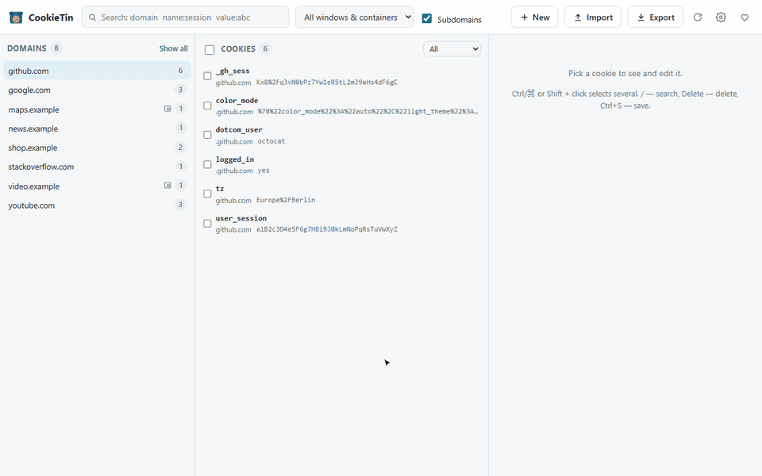
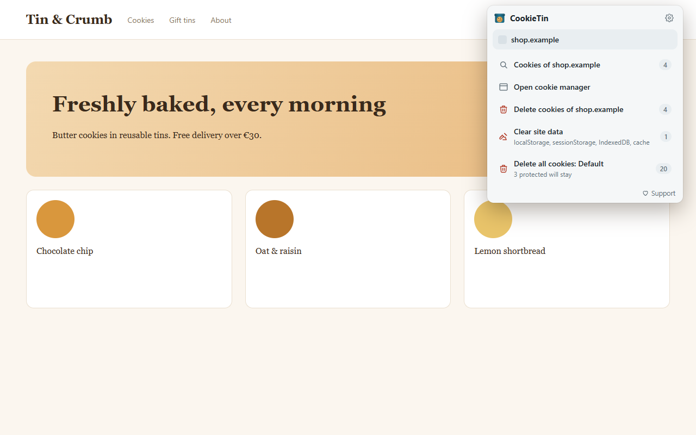
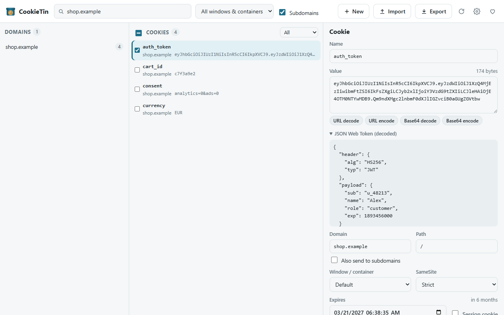
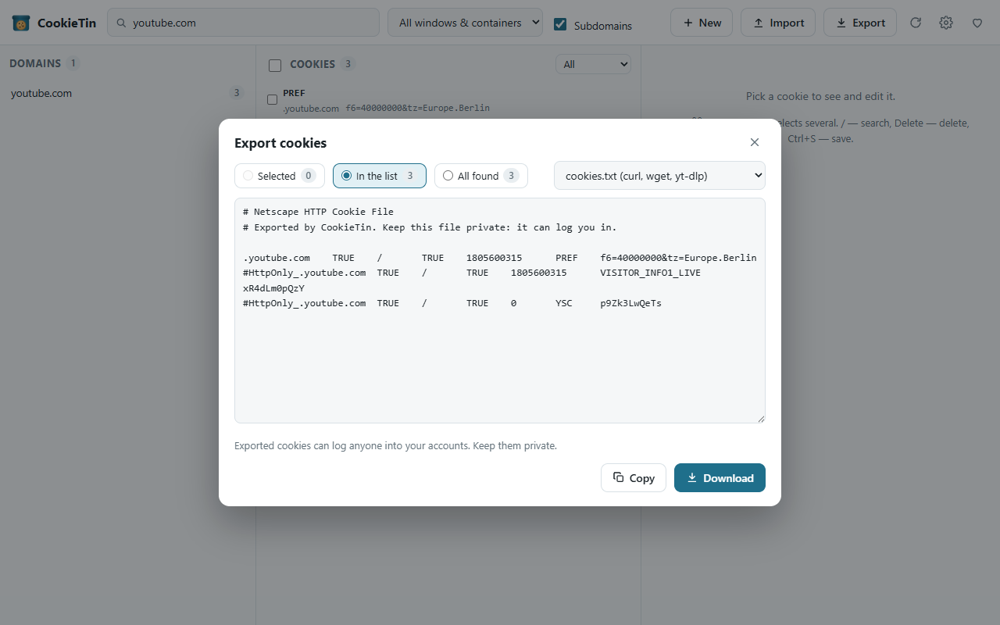
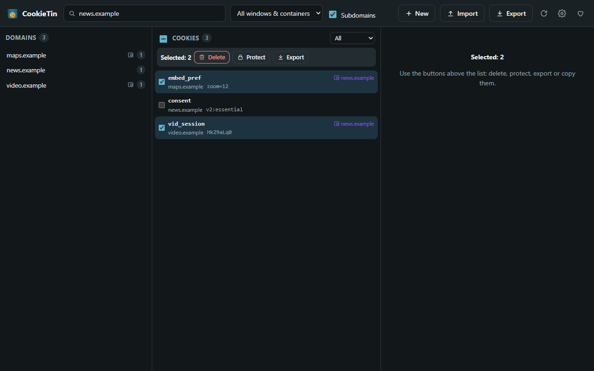
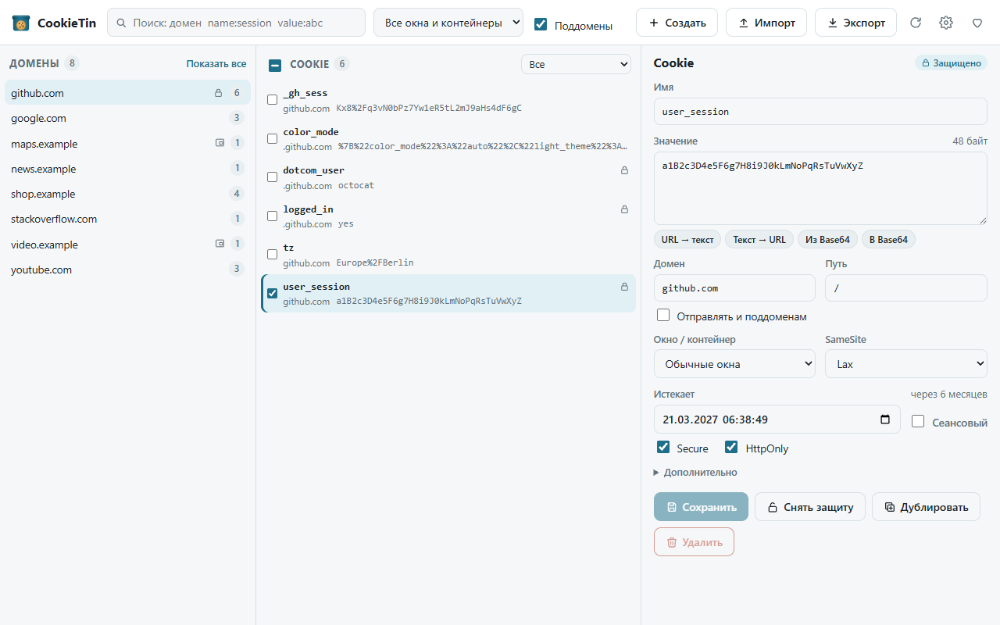

<p align="center">
  
</p>

<h1 align="center">CookieTin</h1>

<p align="center">
  <b>A cookie manager and editor that sees every cookie: containers, private windows and partitioned cookies.</b><br>
  View, edit, protect, import and export cookies in Firefox, Edge and Chrome. Nothing leaves your browser.
</p>

<p align="center">
  <a href="#install">Install</a> ·
  <a href="#features">Features</a> ·
  <a href="#import-and-export">Import & export</a> ·
  <a href="#coming-from-cookie-quick-manager">From Cookie Quick Manager</a> ·
  <a href="#support-the-project">Support</a> ·
  <a href="#русский">Русский</a>
</p>

<p align="center">
  
</p>

## Features

- **Every cookie, including partitioned ones.** Firefox's Total Cookie Protection and Chrome's CHIPS
  keep cookies of embedded sites in separate "partitions". Many managers can't see them, so they
  can't delete them. CookieTin lists, edits and deletes them, and shows which site they are
  stored for.
- **Toolbar menu for the current site.** Open its cookies, delete them (including subdomains and
  the partitioned cookies of embedded sites) with **Undo**, clear the site's localStorage,
  sessionStorage, IndexedDB and cache, or delete all cookies of the window/container.
- **A manager with three columns:** domains, cookies, editor. Search like
  `github name:session value:abc`, select several cookies with Ctrl/Shift or checkboxes, then
  delete, protect, export or copy them to another container at once. Deleting can be undone.
- **A careful editor.** Every attribute: name, value, domain and subdomains, path, expiry or session,
  Secure, HttpOnly, SameSite, container, partition. URL and Base64 decode/encode, JWT decoding,
  byte size, and a warning before the browser would reject the cookie (`__Host-` rules,
  `SameSite=None` without Secure, a date in the past…).
- **Protected cookies.** Lock the cookies that keep you logged in. CookieTin never deletes them and
  can put them back when a site or the browser removes them.
- **Automatic cleanup.** Delete all unprotected cookies when the browser starts and/or every few
  hours, keeping the cookies of sites open in tabs.
- **Containers and private windows.** Firefox Multi-Account Containers and private windows, Chrome
  Incognito; filter by container, copy cookies between containers.
- **Firefox for Android** is supported: the manager opens in a tab.
- English, Russian, German and French interface; light and dark theme; keyboard shortcuts
  (<kbd>/</kbd> search, <kbd>Delete</kbd> delete, <kbd>Ctrl</kbd>+<kbd>S</kbd> save).

| | |
|---|---|
|  |  |
|  |  |

## Install

| Browser | How |
|---|---|
| **Firefox** (desktop and Android) | [Firefox Add-ons (AMO)](https://addons.mozilla.org/firefox/addon/cookietin/) |
| **Microsoft Edge** | Microsoft Edge Add-ons — link will appear here once the listing is approved |
| **Chrome, Brave, Vivaldi, Opera** and other Chromium browsers | Manual install from [GitHub Releases](https://github.com/Perruer/cookietin/releases), see below |

### Chrome: manual install from GitHub Releases

CookieTin is not in the Chrome Web Store, but Chrome can load it directly:

1. Open the [latest release](https://github.com/Perruer/cookietin/releases/latest) and download
   **`cookietin-chrome-<version>.zip`**.
2. Unzip it into a folder you will keep, for example `Documents\CookieTin`.
   Don't delete the folder afterwards: Chrome loads the extension from it.
3. Open **`chrome://extensions`** in the address bar.
4. Turn on **Developer mode** (toggle in the top-right corner).
5. Click **Load unpacked** and select the unzipped folder, the one that contains `manifest.json`.
6. Click the puzzle icon 🧩 on the toolbar and pin **CookieTin** 📌.
7. Optional: to manage Incognito cookies, click **Details** on the CookieTin card and turn on
   **Allow in Incognito**.

To update, download the new zip, replace the files in the same folder and press the ↻ reload
button on the CookieTin card in `chrome://extensions`. Your settings and protected cookies are kept.

> Chrome may show a banner about extensions in developer mode on startup. It's safe to dismiss:
> it appears for every extension that isn't installed from the Chrome Web Store.

The same steps work in Brave (`brave://extensions`), Vivaldi, Opera and Edge (`edge://extensions`).

**Firefox private windows:** Add-ons and themes → CookieTin → **Run in Private Windows** → Allow.

## Import and export

| Format | Export | Import | Works with |
|---|:-:|:-:|---|
| JSON | ✓ | ✓ | Cookie-Editor, EditThisCookie, CookieTin |
| cookies.txt (Netscape) | ✓ | ✓ | curl, wget, yt-dlp, gallery-dl, browser automation |
| Cookie header (`name=value; …`) | ✓ | | curl `-H "Cookie: …"`, HTTP clients |
| Cookie Quick Manager JSON | ✓ | ✓ | Cookie Quick Manager |
| Playwright / Puppeteer storage state | | ✓ | test automation |

Export the selected cookies, the ones in the list or everything the search found; copy to the
clipboard or save to a file. On import, choose the container and whether to protect the imported
cookies. Expired entries are skipped.

> Exported cookies can log anyone into your accounts. Keep such files private.

## Coming from Cookie Quick Manager

CookieTin started as a rewrite of [Cookie Quick Manager](https://github.com/ysard/cookie-quick-manager),
which is no longer maintained. To move over:

1. In Cookie Quick Manager's settings click **Backup user data** and save the file.
2. In CookieTin's settings click **Restore from file…** and pick it.

Your protected cookies and the matching settings (cleanup on startup, website protection,
tab/window mode, deletion prompt, export format) come along. Your cookies themselves stay in the
browser, so there is nothing else to migrate.

### What's new compared to Cookie Quick Manager

- **Works in current Firefox again:** the toolbar menu buttons stopped responding in Firefox 156
  ([cqm#187](https://github.com/ysard/cookie-quick-manager/issues/187)).
- **Partitioned cookies** are listed and deleted; before, some cookies "could not be deleted no
  matter what" ([cqm#121](https://github.com/ysard/cookie-quick-manager/issues/121)).
- **Correct cookies.txt** for yt-dlp and curl ([cqm#96](https://github.com/ysard/cookie-quick-manager/issues/96)),
  and cookies.txt import ([cqm#84](https://github.com/ysard/cookie-quick-manager/issues/84)).
- **Multiple selection** of domains and cookies ([cqm#129](https://github.com/ysard/cookie-quick-manager/issues/129),
  [cqm#12](https://github.com/ysard/cookie-quick-manager/issues/12)), **dark theme**
  ([cqm#143](https://github.com/ysard/cookie-quick-manager/issues/143)), **periodic cleanup**
  ([cqm#91](https://github.com/ysard/cookie-quick-manager/issues/91)), sessionStorage and
  IndexedDB cleaning ([cqm#157](https://github.com/ysard/cookie-quick-manager/issues/157),
  [cqm#161](https://github.com/ysard/cookie-quick-manager/issues/161)), import into a chosen
  container ([cqm#163](https://github.com/ysard/cookie-quick-manager/issues/163)), and an option
  to hide "delete all cookies" from the menu ([cqm#164](https://github.com/ysard/cookie-quick-manager/issues/164)).
- **Chrome and Edge** support, Manifest V3, undo, JWT and Base64 tools, input checks.
- The First-Party Isolation on/off switch was dropped (Firefox replaced FPI with partitioning);
  FPI cookies are still shown and edited, and the `privacy` permission is no longer needed.

Full list in the [changelog](CHANGELOG.md).

## Privacy

CookieTin has no server and sends nothing anywhere: no accounts, no analytics, no network requests
of its own. Cookies are read and changed through the browser's cookies API; settings and the list of
protected cookies are stored in the browser. Details in the [privacy policy](PRIVACY.md).

## Build from source

Requires Node.js 20+.

```bash
npm install
npm run build        # dist/chrome and dist/firefox (unpacked)
npm run dev          # rebuild on change
npm test             # unit tests
npm run test:e2e     # end-to-end tests in Chrome for Testing and Firefox
npm run lint         # web-ext lint for the Firefox build
```

The code is TypeScript + [Preact](https://preactjs.com), bundled with esbuild but not minified.
See [BUILD.md](BUILD.md) for details. Bug reports and pull requests are welcome in
[Issues](https://github.com/Perruer/cookietin/issues).

## Support the project

CookieTin is free, open source, and has no ads or tracking. If it saves you time,
you can support its development:

- **Boosty:** https://boosty.to/mikio_kuroki/donate
- **USDT / TRX, TRON (TRC-20):** `TXUBW4e88SDTfrnJRKfbhYfFcggufbonc1`
- **USDT / USDC / ETH, Ethereum or any EVM network (ERC-20):** `0x1378491169064702786b2E5b58c6375776177E8A`
- **TON / USDT on TON:** `UQAhI7EKzoa-JuKOfv0ULMzA3FrmpxsDkXj8Qevwj2z1cMRN`

Send only on the network listed next to each address. Starring the repository,
leaving a review on the add-on page and reporting bugs help a lot too.

## Based on Cookie Quick Manager by Ysard

CookieTin is based on [Cookie Quick Manager](https://github.com/ysard/cookie-quick-manager) by
[Ysard](https://github.com/ysard), released under the GNU GPL v3. The three-column manager,
protected cookies, container support and the export templates come from it. Thank you!
See [COPYRIGHT](COPYRIGHT) and [THIRD_PARTY_NOTICES.md](THIRD_PARTY_NOTICES.md).

## License

[GNU General Public License v3.0 or later](LICENSE).
© 2017–2019 Ysard (Cookie Quick Manager), © 2026 Perruer (CookieTin).

---

## Русский

**CookieTin** — менеджер и редактор cookie, который видит все cookie: в контейнерах, в приватных
окнах и изолированные (partitioned). Работает в Firefox (и на Android), Edge и Chrome. Данные не
покидают браузер.



### Возможности

- **Все cookie, включая изолированные.** Total Cookie Protection в Firefox и CHIPS в Chrome хранят
  cookie встроенных сайтов отдельно. Многие менеджеры их не видят и не могут удалить. CookieTin
  показывает, правит и удаляет их, а также пишет, для какого сайта они хранятся.
- **Меню кнопки для текущего сайта:** cookie сайта, удаление (вместе с поддоменами и изолированными
  cookie встроенных сайтов) с кнопкой **«Отменить»**, очистка localStorage, sessionStorage, IndexedDB
  и кэша, удаление всех cookie окна или контейнера.
- **Менеджер из трёх колонок:** домены, cookie, редактор. Поиск вида `github name:session value:abc`,
  выбор нескольких cookie (Ctrl/Shift или галочки) и действия над ними сразу: удалить, защитить,
  экспортировать, скопировать в другой контейнер. Удаление можно отменить.
- **Аккуратный редактор:** все атрибуты, раскодирование URL и Base64, расшифровка JWT, размер в байтах
  и предупреждение, если браузер не примет cookie.
- **Защищённые cookie.** Закрепите cookie, на которых держатся входы в аккаунты: CookieTin их не
  удаляет и может вернуть, если их сотрёт сайт или браузер.
- **Автоочистка** при запуске браузера и/или каждые несколько часов, не трогая сайты, открытые во
  вкладках.
- Контейнеры Firefox, приватные окна и инкогнито; интерфейс на русском, английском, немецком и
  французском; светлая и тёмная тема.

### Установка

- **Firefox** (компьютер и Android): [Firefox Add-ons](https://addons.mozilla.org/firefox/addon/cookietin/)
- **Microsoft Edge:** Microsoft Edge Add-ons, ссылка появится после публикации
- **Chrome** и другие браузеры на Chromium (Brave, Vivaldi, Opera), вручную:
  1. Скачайте **`cookietin-chrome-<версия>.zip`** со страницы
     [последнего релиза](https://github.com/Perruer/cookietin/releases/latest).
  2. Распакуйте архив в папку, которую не будете удалять, например `Документы\CookieTin`.
  3. Откройте в адресной строке **`chrome://extensions`**.
  4. Включите **«Режим разработчика»** (переключатель справа вверху).
  5. Нажмите **«Загрузить распакованное расширение»** и выберите распакованную папку (ту, где лежит `manifest.json`).
  6. Нажмите на значок пазла 🧩 на панели и закрепите **CookieTin** 📌.
  7. По желанию: чтобы управлять cookie инкогнито, нажмите **«Сведения»** на карточке CookieTin и
     включите **«Разрешить в режиме инкогнито»**.

  Для обновления скачайте новый архив, замените файлы в той же папке и нажмите ↻ на карточке
  CookieTin в `chrome://extensions`. Настройки и защищённые cookie сохранятся.

### Переход с Cookie Quick Manager

В настройках Cookie Quick Manager нажмите **Backup user data**, а в настройках CookieTin —
**«Восстановить из файла…»**. Защищённые cookie и настройки перенесутся; сами cookie остаются в
браузере.

### Импорт и экспорт

JSON (Cookie-Editor, EditThisCookie), cookies.txt (curl, wget, yt-dlp), заголовок Cookie,
JSON Cookie Quick Manager; импорт также из Playwright/Puppeteer. По экспортированным cookie можно
войти в ваши аккаунты — не передавайте такие файлы.

### Поддержать проект

CookieTin бесплатный, без рекламы и слежки. Если он экономит вам время, можно поддержать разработку:

- **Boosty:** https://boosty.to/mikio_kuroki/donate
- **USDT / TRX (TRON, TRC-20):** `TXUBW4e88SDTfrnJRKfbhYfFcggufbonc1`
- **USDT / USDC / ETH (Ethereum или любая EVM-сеть):** `0x1378491169064702786b2E5b58c6375776177E8A`
- **TON / USDT в сети TON:** `UQAhI7EKzoa-JuKOfv0ULMzA3FrmpxsDkXj8Qevwj2z1cMRN`

Отправляйте только в сети, указанной у адреса. Звезда на GitHub и отзыв в каталоге дополнений тоже очень помогают.

CookieTin основан на [Cookie Quick Manager](https://github.com/ysard/cookie-quick-manager) от Ysard
(лицензия GNU GPL v3).
